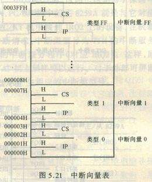

# 汇编语言

### 第十一章 标志寄存器

CPU内部有一种特殊的标志寄存器，对于不同的处理机，其个数和结构都可能不同，具有以下3个作用：

* 用来存储相关指令的某些结果
* 用来为CPU执行相关指令提供行为依据
* 用来控制CPU的相关工作方式

8086CPU的标志寄存器（简称为flag）的结构如下：


#### 11.1 标志位汇总

| 标志位 | 作用                                                         | 受影响指令                                                   |
| ------ | ------------------------------------------------------------ | ------------------------------------------------------------ |
| ZF     | 零标志位，记录相关指令执行后，其结构是否为0，若为0，则zf = 1，否则zf = 0。 | add、sub、mul、div、inc、or、and等逻辑或算法运算指令，mov、push、pop等传送指令不能影响ZF |
| PF     | 奇偶标志位，记录相关指令执行后，其结果的所有bit位中1的个数是否为偶数，为偶数，则pf=1，为奇数，则pf = 0。 | /                                                            |
| SF     | 符号标志位，记录相关指令执行后，其结果是否为负，为负数，则sf = 1，为非负，则sf = 0。 | /                                                            |
| CF     | 进位标志位，进行**无符号**数运算时，记录运算结果的最高有效位向更高有效位的进位值，或从更高位的借位值。 |                                                              |
| OF     | 溢出标志位，记录**有符号**数运算的结果是否发生了溢出，若发生了溢出，则of = 1，没有，则of = 0。 |                                                              |
| DF     | 方向标志位，flag的第十位，控制串传送指令每次操作后si和di的增减 |                                                              |
|        |                                                              |                                                              |

#### 11.2 adc和sbb指令

* adc是带进位加法指令，它利用了CF位上记录的进位值。

指令格式：`adc 操作对象1, 操作对象2`

功能：操作对象1 = 操作对象1 + 操作对象2 + CF

```assembly
# 求0198H与0183H的两数之和
mov ax, 0198H
mov bx, 0183H
# 方法1
add ax, bx
# 方法2
add al, bl
adc ah, bh
```

* sdd是带借位减法指令，它利用了CF位上记录的借位值。

指令格式：`sbb 操作对象1, 操作对象2`

功能：操作对象1 = 操作对象1 - 操作对象2 - CF

sbb指令执行后，将对CF进行设置，利用sbb指令可以对任意大的数据进行减法运算。

```assembly
; 计算003E1000H- 00202000H，结果放在ax，bx中
mov bx, 1000H
mov ax, 003EH
sub bx, 2000H
sbb ax, 0020H
```

#### 11.3 cmp指令

cmp指令是比较指令，功能相当于**减法指令**，只是不保存减法结果，cmp指令执行后，将对标志寄存器产生影响。

指令格式：cmp 操作对象1，操作对象2

功能：计算操作对象1 - 操作对象2，但不保存结果，仅仅根据计算结果对标志位寄存器进行设置。

* **无符号数**比较的相关标志寄存器对比较结果的记录，指令cmp ax, bx

| 标志寄存器状态     | 比较结果     |
| ------------------ | ------------ |
| zf = 1             | (ax) = (bx)  |
| zf = 0             | (ax) != (bx) |
| cf = 1             | (ax) < (bx)  |
| cf = 0             | (ax) >= (bx) |
| cf = 0 并且 zf = 0 | (ax) > (bx)  |
| cf = 1 或 zf = 1   | (ax) <= (bx) |

* 有符号数比较的相关标志寄存器对比较结果的记录，指令cmp ah, bh

> 有符号数减法运算实际结果的正负【指暂时保存在寄存器ax中的指令执行结果2】，之所以不能说明逻辑上真正结果的正负，原因在于发生了溢出，如果没有溢出发生，那实际结果的正负和逻辑上真正结果的正负就一致了。

| 标志寄存器状态 | 比较结果     |
| -------------- | ------------ |
| sf = 1, of = 0 | (ah) < (bh)  |
| sf = 1, of = 1 | (ah) > (bh)  |
| sf = 0, of = 1 | (ah) < (bh)  |
| sf = 0, of = 0 | (ah) >= (bh) |

#### 11.4 检测比较结果的条件转移指令

条件转移指令是指能够根据某种条件决定是否修改IP的汇编指令，例如jcxz指令，若(cx) == 0，则修改IP；大多数条件转移指令都检测标志寄存器的相关寄存器，所有的条件转移指令的转移位移都是[-128, 127]。

因为cmp指令可以同时进行无符号数和有符号数两种比较，所以根据cmp指令的比较结果进行转移的指令也分为两种，即根据**无符号数**比较结果进行转移的条件转移指令【检测zf，cf的值】，和根据**有符号数**比较结果进行转移的条件转移指令【检测sf、of和zf的值】。

下表为常用的根据**无符号数**比较结果进行转移的条件转移指令：

| 指令 | 含义         | 检测的标志位     |
| ---- | ------------ | ---------------- |
| je   | 等于则转移   | zf = 1           |
| jne  | 不等于则转移 | zf = 0           |
| jb   | 低于则转移   | cf = 1           |
| jnb  | 不低于则转移 | cf = 0           |
| ja   | 高于则转移   | cf = 0 且 zf = 0 |
| jna  | 不高于则转移 | cf = 1 或 zf = 1 |

这些条件转移指令通常都和cmp配合使用，就像call和ret指令通常配合使用一样：

```assembly
; 统计data段中数值为8的字节个数，用ax保存统计结果
assume cs:code
data segment
	db 0, 11, 8, 1, 8, 5, 64, 38
data ends

code segment
 start:
 	mov ax, data
 	mov ds, ax
 	mov bx, 0		; ds:[bx]指向data数据
 	mov ax, 0
 	mov cx, 8
 s:
 	cmp byte ptr ds:[bx], 8	; 比较data段中数值和8是否相等
 	jne next
 	inc ax
 next:
 	inc bx
 	loop s			; 循环遍历
 	
	mov ax, 4c00h
	int 21h
code ends
code start
```

#### 11.5 DF标志和串传送指令movsb

* DF：方向标志位，flag的第十位，控制每次操作后si和di的增减

  df = 0，每次操作后di、si递增

  df = 1，每次操作后di、si递减

* 串传送指令

  * movsb

  功能：执行movsb指令相当于

  ```python
  (1) ((es) * 16 + (di)) = ((ds) * 16 + (si))
  (2) 如果df = 0, 则
  		(si) = (si) + 1
  		(di) = (di) + 1
  	如果df = 1，则
  		(si) = (si) - 1
          (di) = (di) - 1
  ```

  可以看出movsb的功能是将ds:si指向的内存单元中的**字节**送入es:di中，然后根据标志寄存器df位的值，将si和di递增或递减。

  * movsw

  可以看出movsw的功能是将ds:si指向的内存单元中的**字**送入es:di中，然后根据标志寄存器df位的值，将si和di递增2或递减2。

需要指出的是，movsb和movsw进行的是串传送指令操作的一个步骤，一般来说，movsb和movsw需要和rep指令配合使用，格式如下：

```assembly
; rep的作用是根据cx的值，重复执行后面的串传送指令
mov cx, 8	; 确定传送长度
rep movsb	; 执行串传送
```

8086CPU提供cld和std指令对df位进行设置：

1. cld指令：将标志寄存器的df位置0
2. std指令：将标志寄存器的df位置1

```assembly
; 将data段中的第一个字符复制到后面的空间中
assume cs:code
data segment
	db 'Welcome to masm!'
  	db 16 dup (0)
data ends

code segment
	mov ax, data
	mov ds, ax		; ds:si指向data:0
	mov si, 0

	mov es, ax
	mov di, 16		; es:di指向data:0010
	mov cx, 16		; (cx) = 16, rep循环16次
	cld				; 设置df = 0，正向传送
	rep movsb

	mov ax, 4c00h
	int 21h
code ends
end start
```

#### 11.6 pushf和popf指令

* pushf：将**标志寄存器**的值压栈
* popf：将**标志寄存器**的值出栈

pushf和popf为直接访问标志寄存器提供了一种方法。

#### 11.7 debug中对标志位的表示

| 标志 | 作用       | 值为1的标志 | 值为0的标志 |
| ---- | ---------- | ----------- | ----------- |
| of   | 溢出标志位 | OV          | NV          |
| sf   | 符号标志位 | NG          | PL          |
| zf   | 零标志位   | ZR          | NZ          |
| pf   | 奇偶标志位 | PE          | PO          |
| cf   | 进位标志位 | CY          | NC          |
| df   | 方向标志位 | DN          | UP          |


### 第十二章 内中断

任何一个通用的CPU，都具备在执行完成当前正在执行的指令之后，检测从CPU外部发送过来或从内部产生的一种特殊信息，并且可以立即对该信息进行处理，这种特殊信息称之为**中断信息**。中断信息可以分为内中断和外中断两种，本章主要讨论内中断。

#### 12.1 内中断的产生

内中断信息存在多种类型，而8086CPU通过**中断类型码**的数据来区分当前中断信息的来源，中断类型码是一个字节型数据，可以表示256种中断信息的来源。我们将**产生中断信息的事件称为中断信息的来源，简称中断源**。

对于8086CPU，当有以下情况发生的时候，将产生相应的中断信息：

| 中断源       | 中断类型码                                                  |
| ------------ | ----------------------------------------------------------- |
| 除法错误     | 0                                                           |
| 单步执行     | 1                                                           |
| 执行into指令 | 4                                                           |
| 执行int指令  | 该指令格式为int n，n为字节型立即数，是提供给CPU的中断类型码 |

#### 12.2 中断处理程序和中断向量表

当中断产生后，CPU会转去执行该中断信息的处理程序，根据CPU的设计，中断类型码的作用就是用来定位中断处理程序的。CPU通过**中断向量表**转到中断处理程序的入口，修改CS和IP的值。

* 中断向量：中断处理程序的入口地址

* 中断向量表：中断向量的列表



总的来说，中断向量表就是中断入口程序地址的列表。中断向量表通过约定一个固定内存存在，对于8086PC机，中断向量表指定在内存地址0处，从内存0000:0000到0000:03FF的1024个内存单元存放，不可修改地址。

对于8086CPU，中断向量表中的一个表项占两个字，**高地址字存放段地址，低地址字存放偏移地址**。

#### 12.3 中断过程

中断过程：CPU硬件通过中断类型码**自动**找到中断向量，并用它设置CS和IP。

在CPU硬件完成中断过程后，CS:IP将指向中断处理程序的入口，CPU开始指向中断处理程序。具体的中断过程可以分为以下6步：

| 中断过程                         | 说明                                                         |
| -------------------------------- | ------------------------------------------------------------ |
| 1. 取得中断类型码                | （从中断信息中）取得中断类型码                               |
| 2. pushf                         | 标志寄存器入栈（因为在中断过程中要改变标志寄存器的值，所以先将其保存于栈中） |
| 3. TF = 0, IF = 0                | 设置标志寄存器的第8位ihe第9位的值为0                         |
| 4. push CS                       | CS的内容入栈，此时CS的内容为中断指令的下一条指令地址         |
| 5. push IP                       | IP的内容入栈                                                 |
| 6. (IP) = (N*4), (CS) = (N\*4+2) | 从内存地址为中断类型码\*4和中断类型码\*4+2【中断向量表保存在内存地址0处，乘以4是因为一个表项占4个字节】的两个字单元中读取中断处理程序入口地址，设置CS和IP |

#### 12.4 中断处理过程和iret指令

由于CPU随时可以执行中断处理程序，所以中断处理程序必需一直存储在内存某段空间内【注意这里和普通程序不同】，而中断处理程序的入口地址，必需存储在对应的中断向量表表项中。

中断处理程序的编写步骤和子程序类似：

* 保存用到的寄存器
* 处理中断
* 恢复用到的寄存器
* 用**iret**指令返回

iret指令的功能为：

```assembly
; 功能：程序返回中断点继续执行
pop IP
pop CS
popf		; 和中断过程入栈顺序刚好相反
```

#### 12.5 除法错误中断的处理

本节通过对0号中断的处理来体会以下前面所讲的内容。


可以看到，当CPU执行div bh时，发生了除法溢出错误，产生0号中断信息，从而引发了中断过程，CPU执行了0号中断处理程序，显示了提示信息后，返回操作系统中。

而我们要想用自己编写的中断处理程序代替原有的中断处理程序，则需要做以下几件事情：

* 编写中断子程序，这里编写0号中断子程序do0，功能为可以显示“overflow”。

* 将do0送入内存中，这里送入内存地址0000:0200处，具体原因可以参考《汇编语言》.王爽 242页。
* 将do0的入口地址0000:0200存储在中断向量表0号表项中。

程序的框架如下：

```assembly
assume cs:code

code segment
 start:
 	do0安装程序
 	设置中断向量表
 	mov ax, 4c00h
 	int 21h
 	
 do0:
 	显示字符串“overflow!”
 	mov ax, 4c00h	; 返回dos系统
 	int 21h
code ends
end start
```

在上述程序框架执行时，子程序do0是不执行的，该程序的目的就是在内存0:0200h处安装do0代码，将0号中断处理程序程序的入口地址设置为0:200h，do0代码虽然在程序中，但不在程序执行的时候执行，而是在除法溢出发生的时候才会作为中断处理程序执行。

#### 12.6 编写安装程序

可以使用movsb指令，将do0的代码送入0:200处。程序框架如下：

```assembly
assume cs:code
code segment
 start:
 	设置es:di指向的目的地址
 	设置ds:si指向的目的地址
 	设置cx为传输长度
 	设置传输方向为正
 	rep movsb
 	
 	设置中断向量表
 	
 	mov ax, 4c00h
 	int 21h
 	
 do0:
 	显示字符串“overflow!”
 	mov ax, 4c00h						; 直接返回dos系统，无需使用iret指令
 	int 21h
code ends
end start
```

更具体的程序如下：

```assembly
assume cs:code
code segment
 start:
	mov ax, cs
	mov ds, ax			
	mov si, offset do0					; 设置ds:si指向源地址
	
	mov ax, 0
	mov es, ax
	mov di, 200h						; 设置es:di指向目的地址
	
	mov cx, offset do0end-offset do0	; 设置cx为传输长度，'-'是编译器识别的运算符号，编译器可以用它进行两个常数的减法

	cld									; 设置传输方向为正
	rep movsb
	
	mov ax, 0
	mov es, ax							; 0号中断在中断向量表的表项地址为0:0，其中0:0存放偏移地址，0:2存放段地址
	mov word ptr es:[0*4], 200h			; 乘以4是因为一个表项占4个字节
	mov word ptr es:[0*4+2], 0
 	
 	mov ax, 4c00h
 	int 21h
 	
 do0:
 	显示字符串“overflow!”
 	mov ax, 4c00h
 	int 21h
 do0end:
 	nop
code ends
end start
```

编译器可以处理表达式，例如`mov ax, (5+3)*5/10`编译器处理为`mov ax, 4`。

#### 12.7 编写中断处理程序do0

```assembly
 do0:
 	jmp short do0start
 	db "overflow!"		; 注意这里，字符串不能像普通程序一样存放于datasg中，因为按照程序指向完后返回，它所占用的内存空间会被系统释放。
 do0start:
 	mov ax, cs
 	mov ds, ax
 	mov si, 202h	; 设置ds:si指向字符串，这里0:202是通过中断程序被复制到的内存地址空间起始地址0:200h加上jmp shor do0start所占的两个字节所得
 	
 	mov ax, 0b800h
 	mov es, ax
 	mov di, 12*160+36*2	; 设置es:di指向显存空间的中间位置
 	
 	mov cx, 9			; 设置cx为字符串长度
 s:
 	mov al, [si]
 	mov es:[di], al
 	inc si
 	add di, 2
 	loop s
 	
 	mov ax, 4c00h
 	int 21h
 do0end:
 	nop
```

#### 12.8 单步中断

除法错误导致溢出产生的中断类型码为0，而**单步中断**的类型码为1，它是在CPU执行完一条指令后，如果检测到标志寄存器的**TF**位为1，则产生的中断过程。它所引发的中断过程如下：

* 取得中断类型码1
* 标志寄存器入栈，TF、IF设置为0
* CS、IP入栈
* (IP) = (1*4)，(CS) = (1\*4+2)

Debug利用CPU可以进行单步中断的特性，控制CPU执行被加载程序中的一条指令后，让它停下来，显示寄存器的状态。具体实现为：

* Debug提供单步中断的中断处理程序，功能为显示所有寄存器中的内容然后等待收入命令。
* 在使用t命令时，Debug将TF设置为1，使CPU工作于单步中断方式下。

则CPU执行完当前指令后，就会引发单步中断，执行单步中断的中断处理程序，将所有寄存器中的内容显示在屏幕上，并等待输入命令。

值得注意的是，当**TF = 1**时，CPU在执行完一条指令引发单步中断，转而执行中断处理程序的时候，中断处理程序也是由多条指令组成，若此时TF仍为1，则CPU在执行完中断处理程序的第一条指令后，又会触发单步中断，转而执行单步中断处理程序，进而CPU进入一个永远不能结束的循环，CPU永远在执行单步中断处理程序的第一条指令。

为了防止这种情况发生，解决的办法就是在CPU进行中断处理程序前，将TF置为0。这里不理解可以回顾一下第3节的中断过程哦。

#### 12.9 响应中断的特殊情况---不响应

CPU不是在任何情况下都会响应中断，在以下特殊情况，CPU在执行完当前指令后，即使发生中断，CPU也不会响应。例如：

```assembly
mov ax, 1000h
mov ss, ax		; 此时CPU不会响应中断
mov sp, 0
```

在执行完向ss寄存器传送数据的指令后，即便发生中断，CPU也不会响应。这是ss:sp联合指向栈顶，对它们的设置应该连续完成。


### 第十三章 int指令

#### 13.1 int指令

格式：`int n`，n为中断类型码

功能：引发中断类型码为n的中断过程

CPU执行`int n`指令，相当于引发一个n号中断的中断过程：

* 取中断类型码n
* 标志寄存器入栈，IF = 0，TF = 0
* CS，IP入栈
* (IP) = (n * 4)，(CS) = (n * 4 + 2)

从此转去执行n号中断的中断处理程序。

#### 13.2 编写供应用程序调用的中断例程

* 编写、安装中断7cH的中断例程计算word型数据的平方，代码参考《汇编语言》.王爽 p253页
* 编写、安装中断7cH的中断例程将一个全是字母，以0结尾的字符串，转化为大写，代码参考《汇编语言》.王爽 p255页

值得注意的是，这些可供应用程序调用的中断例程，只有先执行安装程序，将相应中断例程转为中断处理程序后，才能被应用程序调用。

#### 13.4 用int和iret替换loop指令

* int n：引发中断类型码为n的中断过程。
* iret：IP出栈，CS出栈，标志寄存器出栈，返回中断点继续执行。

要做到用7cH中断例程完成loop指令的替换，需要记录loop s执行时不可获取的两个信息：循环次数和s的位移，我们用cx记录循环次数，用bx记录位移。

```assembly
; 在屏幕中间显示80个！
assume cs:code
code segment
 start:
 	mov ax, 0b800h
 	mov es, ax
 	mov di, 160*12
 	
 	mov bx, offset s - offset se		; 设置从标号se到标号s的转移位移
 	mov cx, 80
 s:
 	mov byte ptr es:[di], '!'
 	add di, 2
 	int 7ch
 se:
 	nop
 	
 	mov ex, 4c00h
 	int 21h
code ends
end start
```

7cH的中断例程为：

```assembly
 ; 引发中断过程后，此时栈中被压入了标志寄存器、CS、IP，此时压入的CS和IP的内存分别是调用程序的段地址【标号s的段地址】和int 7ch后一条指令的偏移地址【标号se的偏移地址】。
 lp:
	push bp				; 因为要访问栈，所以使用了bp，这里先保存bp寄存器原本的值
    mov bp, sp			; 将栈顶指针SP复制到bp中，此时bp中为栈顶的偏移地址
    dec cx				; cx减一
    jcxz lpret			; 检测cx是否为0，若为0，则到lpret标号处继续执行
    add [bp+2], bx		; bx为标号se到标号s的转移位移，((ss)*16+(bp)+2)处为标号se的偏移地址，加上bx后则((ss)*16+(bp)+2)转为标号s的偏移地址
 lpret:
 	pop bp				; 返回原来bp的值
 	iret
```

> 在[...]中使用寄存器bp，而指令中没有显性给出段地址寄存器，段地址就默认在ss中。

#### 13.5 BIOS和DOS

BIOS称为基本输入输出系统，是系统版的ROM中存放的一套程序，其功能和硬件强相关，BIOS的主要功能为：

* **硬件系统**的检测和初始化程序
* 外部中断的内部中断的中断例程
* 用于对**硬件设备**进行I/O操作的中断例程
* 其他和**硬件系统**相关的中断例程

**操作系统**DOS也提供了中断例程，从操作系统的角度，DOS提供的中断例程就是操作系统向程序员提供的编程资源。

BIOS和DOS的中断安装例程大致为：先由CPU最初的CS和IP转跳到BIOS的硬件检测和初始化程序，这里BIOS将建立中断向量表，完成后，再由BIOS调用int 19h中断例程进入DOS的操作系统引导，DOS启动后，将自己的中断例程装入内存并建立中断向量表。

##### 13.5.1 BIOS中断例程应用

int 10h中断例程是BIOS提供的中断例程，其中包含了多个和屏幕输出相关的子程序，中断例程通过内部传递进来的参数来决定执行哪一个子程序，BIOS和DOS提供的中断例程，都是用**ah**来传递内部子程序的编号。

```assembly
assume cs:code
code segment
 start:
 	; 设置光标位置
 	mov ah, 2			; 设置10h对应的中断例程功能为置光标
 	mov bh, 0			; 第0页
 	mov dh, 5			; dh中放行号
 	mov dl, 12			; dl中放列号
 	int 10h
 	
 	; 在光标位置显示字符
 	mov ah, 9			; 在光标位置显示字符
 	mov al, 'a'			; 字符
    mov bl, 11001010b	; 颜色属性
    mob bh, 0			; 第0页
    mov cx, 3			; 字符重复个数
    int 10h
    
    mov ax, 4c00h
    int 21h
code ends
end start
```

##### 13.5.2 DOS中断例程应用

int 21h中断是DOS提供的中断例程，和BIOS的中断例程一样，DOS的21h中断同样通过ah来决定哪一个子程序，我们前面一直使用的int 21h中断例程的4ch号功能，是程序的返回功能，具体功能如下：

```assembly
mov ah, 4ch		; 程序返回
mov al, 0		; 返回值
int 21h
```

(ah) = 9时调用21h号中断例程的9号子程序，功能为在**光标位置**显示字符串，可以提供要显示字符串的地址作为参数。

```assembly
; 在屏幕的5行12列显示字符串“Welcome to masm!”
assume cs:code
data segment
 db 'welcome to masm', '$'
data ends

code segment
 start:
 	mov ah, 2	; 首先置光标
 	mov	bh, 0	; 第0页
 	mov dh, 5	; dh中放行号
 	mov dl, 12	; dl中放列号
 	int 10h
 	
 	mov ax, data
 	mov ds, ax
 	mov dx, 0	; ds:dx指向字符串的首地址data:0
 	mov ah, 9
 	int 21h
 	
 	mov ax, 4c00h
 	int 21h
code ends
end start
```


### 第十四章 端口

前面讲过，CPU和**各种存储器**通过数据线，控制线，地址线相连，CPU在操作它们的时候，把它们都当作内存对待。在PC机中，除了各类存储器，还有以下3中芯片：

* 各种接口卡（网卡、显卡等）上的接口芯片，他们控制接口卡的工作
* 主板上的接口芯片，CPU通过控制它们对部分外设进行访问
* 其他芯片，用来存储相关系统信息或进行相关输入输出的处理

以上这些芯片都存在可由CPU读写的**寄存器**，CPU都可以对它们进行读写操作。可见CPU将这些寄存器当作端口，对它们进行统一编制，从而建立一个统一的地址空间，每一个端口在地址空间中都对应一个地址。

总的来说，CPU可以对3个地方进行读写操作

* CPU内部的存储器
* 内存单元
* 端口

#### 14.1 端口读写

CPU通过地址总线来定位端口，在8086CPU的地址总线宽度为16位，所以CPU最多可以定位64KB个不同端口，地址范围为0~65535。对端口的读写不能采用mov，pop，push等内存读写指令，端口的读写指令只有两条，**in**和**out**，**以CPU为主体**，分别对应从端口读取数据和往端口写入数据。

`in al, 60h`，执行时与总线相关的操作：

* CPU通过**地址总线**将地址60h发送出去
* CPU通过**控制总线**发出读端口命令，选择地址总线上对应的端口，并通过端口，将要读数据
* 端口所在的芯片将60h端口中的数据通过**数据总线**发送到CPU

**int和out指令只能使用al或ax来存放从端口中读取或要发送到端口的数据。**

```assembly
; 对0~255以内的端口进行读写
in al, 20h			; 从20h端口读入一个字节
out 20h, al			; 往20h端口写入一个字节

; 对256~65535的端口进行读写，端口号放在dx中
mov dx, 3f8h		; 将端口3f8h送入dx
in al, dx			; 从3f8h端口读入一个字节
out dx, al			; 往3f8h端口写入一个字节		   
```

#### 14.2 shl和shr指令

shl和shr是逻辑位移指令

shl是逻辑左移指令：

* 将一个**寄存器**或**内存单元**中的数据向左移位
* 将最后移出的一位写入CF中
* 最低位用0补充
* 如果移位数大于1时，必需将移位数放在**cl**中

```assembly
mov al, 01001000b
shl al, 1			; 将al中的数据左移一位，移位后(al) = 10010000b，CF = 0
```

shr是逻辑右移指令，它和shl所进行的操作刚好相反。【最高位也是用0补充，这里没有相反】

#### 14.3 CMOS RAM芯片

该芯片中有一个128个存储单元的RAM存储器，内部实时时钟占用0~0dh单元来保护时间信息。在CMOS RAM中，存放着当前的时间：年，月，日，时，分，秒，这6个信息的长度都为1个字节，存放单元为：

秒：0		分：2		时：4		日：7		月：8		年：9

这些时间信息以BCD码的形式存储，BCD码值 = 十进制数码置，则BCD码值 + 30h = 十进制数对应的ACSII码。

该芯片内部有两个端口，端口地址为70h【地址端口】和71h【数据端口】，地址端口存放要访问CMOS RAM单元的地址，数据端口存放选定的CMOS RAM单元中读取数据或要写入到其中的数据。CPU通过这两个端口来读写CMOS RAM。

```assembly
; 在屏幕中央显示当前的月份
assume cs:code
code segment
 start:

    mov al, 8h
    out 70h, al
    in	al, 71h			; 从8号单元读出当前月份的BCD码

    mov ah, al			; 将月份数据复制到ah中
    mov cl, 4
    shr	ah, cl			; 将ah右移四位，只保存月份数据中的十位
    and al, 00001111b	; 只保存月份数据中的个位

	add ah, 30h
	add al, 30h			; 将BCD码转为ASCII码
	
	mov bx, 0B800h
	mov es, bx
	mov byte ptr es:[160*12+40*2], ah	; 显示月份的十位码
	mov byte ptr es:[160*12+40*2+2], al	; 显示月份的个位码
	
	mov ax, 4c00h
	int 21h
code ends
end start
```


### 第十五章 外中断

我们知道，CPU处理能执行指令，进行运算外，还应该能够对外部设备进行控制，接受它们的输入，并向它们进行输出，也就是说，CPU除了有运算能力外，还要有I/O(Input/Output，输入/输出)能力。

#### 15.1 接口芯片和端口

PC系统的接口卡和主板上，安装了各种接口芯片，这些外设接口芯片内部有若干寄存器，CPU将这些寄存器当作端口来访问，CPU对外设的一切操作，都先需要送入外设所对应接口芯片的端口中，再由接口芯片送到外设，外设输出到CPU的控制命令也一样。

总的来说，CPU通过端口和外部设备进行联系。

#### 15.2 外中断

由于外设的输入随时可能发生，可以推断CPU采用中断机制处理外设的输入。和内中断一样，当外设的输入达到，相关芯片将向CPU发出相应的中断信息，CPU在执行完当前指令后，可以检测发送过来的中断信息，引发中断过程，进而处理外设的输入。

外中断源一共有以下两类：

* **可屏蔽中断**

可屏蔽中断时CPU可以不相应的中断，CPU是否响应可屏蔽中断要看标志寄存器中的**IF**位的设置【内中断看TF位】，当CPU检测到可屏蔽中断信息时，如果**IF=1**，则CPU在执行完当前指令后响应中断，若**IF=0**，则不响应。

外中断和内中断过程对比：

| 内中断过程                       | 外中断过程                       |
| -------------------------------- | -------------------------------- |
| 1. 取得中断类型码，CPU内部产生   | 1. 通过数据总线获取中断类型码    |
| 2. pushf                         | 2.pushf                          |
| 3. TF = 0, IF = 0                | 3. TF = 0, IF = 0                |
| 4. push CS                       | 4. push CS                       |
| 5. push IP                       | 5. push IP                       |
| 6. (IP) = (N*4), (CS) = (N\*4+2) | 6. (IP) = (N*4), (CS) = (N\*4+2) |

> pushf指令功能为保存标志寄存器

如果在中断处理过程中需要处理可屏蔽中断，可以通过指令将IF置1：

1. sti，设置IF = 1
2. cli，设置IF = 0

* **不可屏蔽中断**

不可屏蔽中断是CPU必需响应的中断，在8086CPU中，不可屏蔽中断的中断类型码为2，在中断过程中，不需要获取中断类型码这一步。**几乎所有的外中断都是可屏蔽中断**。

#### 15.3 PC机键盘的处理过程

通过键盘体会PC机处理外设的基本方法。

键盘上的每一个键相当于一个开关，键盘中有一个芯片对键盘上的每一个按键的开光形态进行扫描，当按下一个按键，开光接通，该芯片就产生一个对应的扫描码，扫描码被送入主板上的接口芯片的寄存器中，该寄存器的端口地址为60h，松开按键时，也产生一个扫描码，说明松开按键的位置，同时产生的扫描码也被送入60h端口中。

按下一个按键时产生的扫描码称为**通码**，松开按键时产生的扫描码被称为**断码**。扫描码长度为一个字节，通码的第7位为0，断码的第7位为1。

断码 =  通码 + 80h


##### 15.3.1 键盘触发9号中断

当键盘的输入达到60h号端口时，相关芯片会向CPU发出中断类型码为9的可屏蔽中断信息，CPU检测到该信息后，若IF = 1，则响应中断，引发中断过程，转去执行int 9中断例程。

##### 15.3.2 执行9号中断例程

BIOS提供的9号中断例程的主要工作如下：

* 读出60h端口中的扫描码
* 若是字符键的扫描码，将该扫描码和它所对应的字符码（ASCII码）送入内存中的BIOS键盘缓冲区；如果是控制键或切换键，则将其转变为状态字（用二进制记录控制键和切换键的字节）写入内存中存储状态字节的单元。
* 对键盘系统进行相关的控制。例如向相关芯片发送应答信息。

在BIOS的键盘缓冲区中，一个键盘输入用一个字单元存入，高位字节存放扫描码，低位字节存放字符码。0040:17单元存储键盘状态字节，该字节记录了控制键和切换键的状态，具体见p275。

##### 15.3.3 编写int 9中断例程

可以看出，键盘输入的处理过程为：

1. 键盘产生扫描码
2. 扫描码送入60h端口
3. 引发9号中断
4. CPU执行int 9中断例程处理键盘输入

以上1 2 3步都是由硬件自动完成，我们可以重新编写的部分为int 9中断例程，按照自己的意图来处理键盘输入，但我们**不准备完整编写一个键盘中断处理程序**，其中涉及一些硬件处理【可能是因为比较难】，我们只编写部分逻辑，对此，我们需要**在自己编写的9号中断例程中调用BIOS的int 9中断例程**。

编程：在屏幕中间依次显示”a“ ~ "z"，并可以看清，在显示过程中，按下Esc按键后，改变显示颜色。

以下只记录一些比较重要的点，具体代码见ex15_1.asm：

* 先实现在屏幕中间依次显示”a“ ~ "z"，并可以看清，这里介绍CPU执行空循环代码

```assembly
	mov dx, 10h		; CPU循环100000h次
	mov ax, 0
 s:
 	sub ax, 1		; 这里产生借位
 	sbb dx, 0		; dx执行带借位减法
 	cmp ax, 0		; 比较ax中的值是否为0
 	jne s			; 不等于则转移
 	cmp dx, 0
 	jne s
```

* 编写9号中断例程，在中断例程中调用BIOS的int 9中断例程，这里由于此时中断向量表中的9号中断例程的入口地址被修改，所以此时不能直接通过int 9去调用BIOS的9号中断例程，需要我们自己写代码代替int 9。

```assembly
			; 无需取中断类型码确定中断入口地址，我们将BIOS int 9的偏移地址和段地址保存于ds:[0]和ds:[2]单元中【这里不安装中断例程】
pushf		; 标志寄存器入栈

pushf
pop ax
and ah, 11111100b	; IF和TF为标记寄存器第9和第8位
push ax
popf				; IF = 0, TF = 0

call dword ptr ds:[0]	; CS，IP入栈，(IP)=((ds)*16+0), (CS)=((ds)*16+2)
```

* 在程序返回前，将中断向量表中的int 9中断例程的入口地址还原，否则程序返回后，别的程序将无法使用键盘，因为此时int 9中断的入口地址还指向以及释放的程序段地址。

* 若要安装中断例程，则此时原BIOS int 9的偏移地址和段地址不能保存于data segment中，可以和中断例程保存同一个内存单元【0:200h】。


### 第十六章 直接定址表

#### 16.1 数据标号

* 在code段中使用没有”：“的标号a，b，它们是同时描述**内存地址**和**单元长度**的标号，我们将这种标号称为**数据标号**。

```assembly
assume cs:code
code segment
	a db 1,2,3,4,5,6,7,8		; 定义在代码段中的数据标号
	b dw 0
	
 start:
 	mov si, 0
 	mov cx, 8
 s:
 	mov al, a[si]
 	mov ah, 0
 	add b, ax
 	inc si
 	loop s
 	
 	mov ax, 4c00h
 	int 21h
code ends
end start
```

* 一般来说，我们不在代码段中定义数据，在其他段中，我们也可以通过数据标号来描述存储数据单元的地址和长度。**注意，在后面加有”：“的地址标号，只能在代码段中使用，不能在其他段中使用**。

```assembly
assume cs:code, ds:data		; 注意这里添加了对data数据段和ds寄存器的假设
data segment
	a db 1,2,3,4,5,6,7,8
	b dw 0
data ends
code segment
	mov ax, data			; 程序中仍需要使用指令对段寄存器进行设置
	mov ds, ax
	
	mov si, 0
	mov cx, 8
 s:
	mov al, a[si]			; 编译器将该指令编译为：mov al, [si+0]
	mov ah, 0
	add b, ax				; 编译为: add [4], ax
	inc si
	loop s
	
	mov ax, 4c00h
	int 21h
code ends
end
```

以上包含数据标号的指令在编译时，都默认所访问单元的地址都在ds中，此时ds中的值为空或为默认值，而实际访问的段为data，所以要访问正确，在这些指令执行前，ds中必需为data段的段地址。

* 数据标号也可以当作数据来定义，此时编译器将标号所表示的地址当作数据的值

```assembly
data segment
	a db 1,2,3,4,5,6,7,8
	d dw 0
	c dw a, b			; 等价于 c dw offset a, offset b
data ends

data segment
	a db 1,2,3,4,5,6,7,8
	d dw 0
	c dd a, b			; 等价于 c dw offset a, seg a, offset b, seg b
data ends
```

> seg操作符，功能为取得某一标号的段地址。

#### 16.2 直接定址表

直接定址表就是用查表的方法编写相关程序的技巧。

编写子程序：用十六进制的形式在屏幕中间打印字节型数据。

分析：用十六进制的形式打印字节型数据需要将八位数据分高四位和低四位转为对应的十六进制字符串，而0~9和‘0’~‘9’的ASCII码映射关系为 0 + 30h = '0', 10 ~ 15和‘A’ ~ 'F'的映射关系为 10 + 37h = 'A'。二者映射关系不统一，没有一致性的映射关系存在，这里可以采用直接定址表通过查表的方式来描述映射关系。

```assembly
; 用al传送要显示的数据
 showtyte:
 	jmp short show
 	table db '0123456789ABCDEF'		; 字符表
 show:
 	push bx
 	push es
 	
 	mov ah, al
 	mov cx, 4
 	shr ah, cx						; 右移4位，ah中得到高4位的值
 	add al, 00001111b				; al中保留低4位的值
 	
 	mov bl, ah
 	mov bh, 0
 	mov ah, table[bx]				; 用高4位的值作为相对于table的偏移，得到对应的字符
 	
 	mov bl, al
 	mov bh, 0
 	mov al, table[bx]				; 用低4位的值作为相对于table的偏移，得到对应的字符
 	
 	mov bx, 0b800h
 	mov es, bx
 	mov es:[160*12+40*2], ah
 	mov es:[160*12+40*2+2], al
 	
 	pop es
 	pop bx
 	
 	ret
```

#### 16.3 程序入口的直接定址表

可以直接在定址表中存储子程序的地址，从而方便实现不同子程序的调用。

```assembly
sub1:			; 子程序1
	...
sub2:			; 子程序2
	...
sub3:			; 子程序3
	...

setscreen:
	jmp short set
	table dw sub1, sub2, sub3	; 包含子程序偏移地址的直接定址表
set:
	...
```


### 第十七章 使用BIOS进行键盘输入和磁盘读写

#### 17.1 int 9中断例程对键盘输入的处理

简单来说就是将键盘输入写入键盘缓冲区。

已知在键盘按下后将引发9号中断，BIOS提供了9号中断例程，动作分为以下三步：

* 从60h号端口读取键盘扫描码
* 将其转化为ASCII码或状态信息
* 储存到内存指定空间（键盘缓冲区或状态字节）

#### 17.2 使用int 16h中断例程读取键盘缓冲区

BIOS提供了int 16h中断例程，int 16h中断例程一个重要功能就是从键盘缓冲区读取一个键盘输入，该功能编号为0。

```assembly
mov ah, 0
int 16h
; (ah) = 扫描码，(al) = ASCII码
; 从键盘缓冲区读取一个键盘输入，并将其从缓冲区中删除
```

int 9中断可以通过in指令从端口读取键盘输入，int 16h从键盘缓冲区读取键盘输入，扫描码保存于ah，ASCII码保存于al。

可见，BIOS的int 9中断例程和int 16h中断例程是一对相互配合的程序，int 9中断例程向键盘缓冲区写入，int 16h中断例程从缓冲区读取。在int 16h中断例程中肯定有设置`IF = 1`的指令，因为当键盘缓冲区为空时，int 16h中断会循环读取键盘缓冲区直到有新的输入，若IF = 0，则外中断被屏蔽，这会造成死锁。


